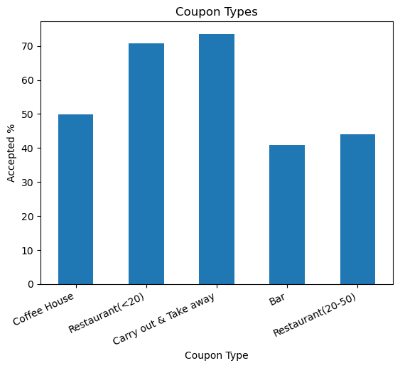
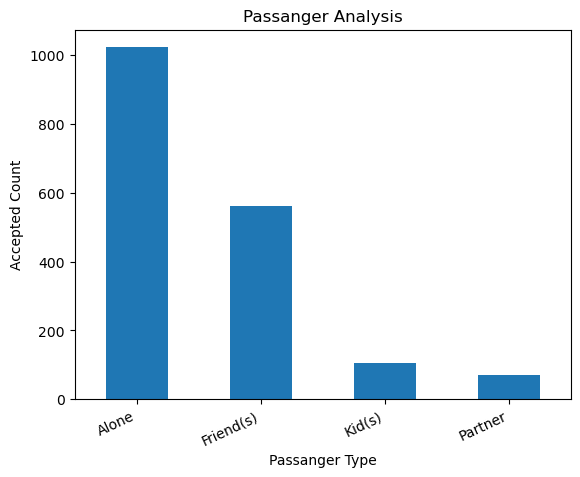

# Coupon Analysis

## Context

Imagine driving through town and a coupon is delivered to your cell phone for a restaurant near where you are driving. Would you accept that coupon and take a short detour to the restaurant? Figure out the factors that determine whether a driver accepts the coupon once it is delivered to them.

## Goal

The goal of this project is to use what you know about visualizations and probability distributions to distinguish between customers who accepted a driving coupon versus those that did not.

## About Data

* Collected from UCI Machine Learning repository and was collected via a survey on Amazon Mechanical Turk
* **Y = 1**, if user will drive there **right away or later before the coupon expires**
* **Y = 0**, if user **don't** want the coupon
* Coupon Types
   * Bar
   * Coffee houses
   * Carry out & Take away
   * Less expensive restaurants (under 20)
   * More expensive restaurants (20 - $50)
* Attributes
   * User Attributes like **_age, gender, marital status_**
   * Contextual Attributes like **_location, weather, temperature, time, passenger details_**
   * Coupon Attributes like **_coupon expiry time_**

## Overall Analysis

* 56.84% of all coupons accepted by the drivers/users
* ** Carry out & Take away** coupons were the **_most_** accepted coupon count percentage
* **Bar** coupon were the **_least_** accepted coupon count percentage.
* Coupon vs Count Chart

## Coupon Analysis for Bar

### Link for Notebook
[Jupyter Notebook for Analysis](./prompt.ipynb)

### Summary
## Hypothesis about drivers who accepted the bar coupons:
1. Acceptance rate for Drivers who went to bar 3 or more times: **76.88%**
2. Acceptance rate for Drivers who went to fewer trips to bar: **37.06%**
3. Comparison between those who went to a bar 3 or fewer times a month to those who went more **39.82%**
4. Acceptance rate between drivers who go to a bar more than once a month and are over the age of 25 to the all others: **28.52%**
5. **69.52%** of the drivers who go to a bar more than once a month and are over the age of 25 accepted the coupons. 
6. Driver who go to bars more than once a month and had passengers that were not a kid and had occupations other than farming, fishing, or forestry: **71.32%**
7. Acceptance rate for drivers with below conditions: **30.32%**
    * go to bars more than once a month, had passengers that were not a kid, and were not widowed OR
    * go to bars more than once a month and are under the age of 30 OR
    * go to cheap restaurants more than 4 times a month and income is less than 50K.

### Next Steps and Recommendation

* Send Bar coupons to drivers with the below conditions:
    * Drivers who visits the bar frequently(more than 3 times)
    * Drivers who go to a bar more than once a month and are over the age of 25 accepted the coupons. 
    * Driver who go to bars more than once a month and had passengers that were not a kid and had occupations other than farming, fishing, or forestry

## Independent Analysis for Carry out & Take Away

### Summary 
* **Carry out & Take away** were the most accepted coupons among the drivers
* As per the passanger analysis, the drivers who were **_Alone_** used the Carry out & Take away coupons than the other passangers.
* Bar plot for Passangar who accepted coupons for Carry out & Take away

### Next Steps and Recommendation

* Send more Carry out & Take away coupons to driver for the below conditions
    * Alone (without any passangers)
    * With Friends

